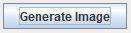

# Random-Imgur 

a program to fetch random images from imgur. This occurs one at a time upon hitting a button. You can also download the image, or go back and view some previous images fetched.

## Table of contents
- [Features](#features)
- [Installation](#installation)
- [User Guide](#user-guide)
- [Disclaimer](#disclaimer)
- [License](#license)
- [Credits](#credits)

## Features

- Dynamic frame and Image resizing

## Installation

## User Guide

Click **Generate Image** to start the process

Click **Download** to download the current photo

Click **Gallery** to view the previous nine images

## Disclaimer
Unfortunatley the internet is the internet, so upon retrieving an image from Imgur, there is no telling what you will get. Please see the [Imgur terms of service](https://imgur.com/tos) for more information. We did not create, place, or change the chances of generating any particular image or type of image.
## Getting Started
to use this app, simply run the Random Imgur exe, or open the code into a jave ide, and run it from the source code. 
## License
This project is licensed under the MIT License - see the [LICENSE.md](LICENSE) file for details
## Credits
Created by Aryeh Bloom and Jack Seigerman
